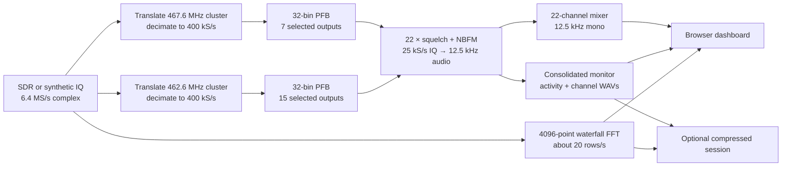

# All-channel FRS receiver

Experimental GNU Radio receiver and touch-friendly browser interface for
monitoring all 22 analog FRS channels from one wideband SDR capture.

## Features

- Two sparse 32-bin polyphase channelizers covering only the occupied FRS bands
- Independent power squelch and NBFM demodulation for every channel
- Mixed live audio plus separate 12.5 kHz channel recordings
- Live waterfall with selectable conversation borders and touch history browsing
- Compact, reopenable sessions containing compressed waterfall rows and audio
- PlutoPlus-like synthetic IQ fixture, DSP self-test, and throughput benchmark

`frs_all_channels.py` simultaneously tunes all 22 analog FRS channels,
applies an independent power squelch to each channel, NBFM-demodulates open
channels, and mixes them into one mono 12.5 kHz audio stream. Its Qt GUI displays
the live RF waterfall, a live squelch control, and a touch-scrollable channel
activity timeline.

Each transmission is also saved separately under `recordings/channel_01/`
through `recordings/channel_22/`. Files are timestamped 12.5 kHz mono PCM WAV
clips, matching the useful bandwidth of narrowband FRS voice. Recording closes
at the first silent squelched block, without adding post-key-off audio. Live mixing and browser
streaming use the same rate; Web Audio resamples to the device's native output
rate. Set
`--record-dir /some/path` to choose another location or `--record-dir ''` to
disable recording.

The browser dashboard starts with speaker output muted. **Live audio** toggles the mixed audio
without affecting recording. Colored border rectangles are drawn over
the waterfall at their channel frequency and grow with each transmission.
Drag/wheel gestures scroll the stored spectrum and transmission borders
together; tap a border to play that channel continuously from the selected
time, including silence between transmissions. The active border turns white,
a playback marker follows the channel timeline, and an on-plot badge shows the
source channel. A predominantly horizontal two-finger pinch zooms frequency
only, making adjacent 12.5 kHz channels easier to select; a predominantly
vertical pinch zooms time only. Once frequency is zoomed, a one-finger horizontal
drag pans across the RF spectrum while a vertical drag continues to browse time.
Press **Live** to return to the current edge. The custom renderer
retains ten minutes of waterfall history in memory unless a disk session is
being recorded.

The SDR must expose at least about 5.2 MHz of *usable* instantaneous bandwidth.
An RTL-SDR cannot cover the full FRS allocation in one capture; a wideband
device such as a PlutoPlus or HackRF-class receiver can. Receive only signals you are legally
permitted to monitor in your jurisdiction.

## Requirements

- Linux
- Python 3.10 or newer
- GNU Radio 3.10
- gr-osmosdr with the backend required by your SDR
- NumPy and PyQt5
- A receiver providing at least approximately 5.2 MHz of usable bandwidth

On Debian or Ubuntu, the basic development dependencies are typically:

```bash
sudo apt update
sudo apt install gnuradio gr-osmosdr python3-numpy python3-pyqt5
```

Pluto-family devices may additionally require libiio/AD936x packages or a
gr-osmosdr build with Pluto support, depending on the distribution.

## Run

```bash
chmod +x frs_all_channels.py
./frs_all_channels.py --device 'hackrf=0' --gain 24 --squelch -55
```

For a PlutoPlus through gr-osmosdr/libiio, the device argument is commonly:

```bash
./frs_all_channels.py --device 'plutosdr=0' --gain 40 --squelch -55
```

## Synthetic PlutoPlus test input

Run the GUI without radio hardware using repeatable 6.4 MS/s complex IQ. Its
12-second scenario contains scripted, voice-band synthetic exchanges with gaps
and overlaps on channels 1, 3, 6, 8, 12, and 20. Channel 15 carries a deliberately
weak transmission. The synthetic noise floor is approximately -96 dBFS and
signal strengths span 10–60 dB above it. The displayed power, generated IQ,
and squelch decisions all use that same scale. Synthetic transmitters use a
12 ms RF power ramp so key-up/down does not create unrealistic broadband
splatter:

```bash
./frs_all_channels.py --test-input
```

The first full-DSP test run generates one 12-second complex-float period under
`work/` (about 586 MiB), then GNU Radio repeats that file directly. Subsequent
runs reuse it, keeping Python out of the real-time IQ path. Use
`--regenerate-test-iq` to rebuild it or `--test-iq-file PATH` to place/reuse it
somewhere else.

Run the automated headless DSP/squelch check. It defaults to a deliberately low
-84 dB squelch threshold, includes simultaneous channels 1 and 15 at 12.5 kHz
spacing with channel 1 50 dB stronger, and verifies that the weak adjacent
channel remains closed:

```bash
./frs_all_channels.py --self-test
```

For the browser dashboard, `--web --test-input` uses the same repeating
channel plan as a wall-clock-paced fixture. This keeps its 12.5 kHz live audio,
waterfall, and per-channel WAVs genuinely real-time on development machines.
`--self-test` continues to exercise the complete synthetic-IQ/PFB DSP path.

To inspect realistic receiver noise and squelch behavior in the browser, use
the complete synthetic-IQ path instead of the lightweight fixture:

```bash
./frs_all_channels.py --web --test-input --web-real-iq
```

This translates the two occupied FRS clusters to baseband, decimates each to
400 kS/s, and feeds two 32-bin PFB analysis banks. The banks extract only the 22
required outputs, while one consolidated monitor handles
per-channel levels and 12.5 kHz recordings. Each 25 kS/s PFB channel now feeds
the NBFM receiver directly, eliminating the former complex and audio resamplers.

To record the composite stream instead of playing it:

```bash
./frs_all_channels.py --device 'hackrf=0' --wav frs.wav
```

Start with a high squelch threshold such as `-45`, then lower it until idle
channels just begin to open and raise it a few dB. The right value depends on
the SDR, RF gain, antenna, and local noise. `--ppm` corrects oscillator error.

Use `--help` for all settings. The default RF rate is 6.4 MS/s and must remain
an integer multiple of both 64 kS/s and 400 kS/s. The lower rate still includes
all FRS channels with guard bandwidth while reducing wideband work by 20%.

## Phone or browser dashboard

Keep the SDR connected to this computer and start the token-protected local
dashboard:

```bash
./frs_all_channels.py --web --device 'plutosdr=0' --gain 40 --squelch -55
```

The terminal prints a URL such as `http://192.168.1.41:8765/?token=...`. Open
that exact URL on a phone connected to the same LAN or private VPN. The random
token changes each run; do not forward port 8765 to the public internet.

The responsive dashboard provides the high-resolution waterfall, touch history
browsing, conversation selection/playback, browser live audio, and remote
squelch control. It retains ten minutes of compact waterfall history. Use
`--web-host 127.0.0.1` when access should be limited to this computer, or
`--web-port` to choose another port.

## Record and reopen a session

Add `--record-session` to preserve the full session without saving raw IQ:

```bash
./frs_all_channels.py --web --device 'plutosdr=0' --gain 40 --squelch -55 \
  --record-session sessions/field-day.frs-session
```

The target must be a new or empty directory. It contains `session.sqlite3`
with compressed 8-bit waterfall rows and timing metadata, plus the separate
mono WAV files under `audio/channel_01/` through `audio/channel_22/`. Paths and
timestamps are session-relative, so the whole `.frs-session` directory can be
moved to another location or machine as one unit.

Reopen it later in the same touch-friendly dashboard:

```bash
./frs_all_channels.py --open-session sessions/field-day.frs-session
```

Opening a session does not initialize the SDR. The dashboard replaces **Live**
with **End**, disables the live-audio and squelch controls, and loads older
waterfall windows from disk only as you scroll. Conversation borders remain
selectable and play their saved channel timeline, including silence and later
transmissions on that channel.

To exercise the complete save/open workflow without an SDR:

```bash
./frs_all_channels.py --test-input \
  --record-session sessions/demo.frs-session
```

## Architecture



Each GNU Radio PFB accepts commutated phase inputs internally exposed as stream
ports. There are two 32-bin channelizers, not 64 independent PFBs.

### Portable FPGA receive prototype

`fpga/frs_receive_core.sv` is a board-independent SystemVerilog prototype of
the same 6.4 MS/s → dual 400 kS/s DDC → two sparse 32-bin PFBs → 22 tagged
12.5 kHz audio paths. Its input is signed 12-bit ADC I/Q, converted at the
wrapper boundary to Q1.15 by shifting left four bits. This is an explicit
assumption; confirm the PlutoPlus/AD9363 HDL's exact ADC word formatting before
connecting the board. The core is a reference implementation, not yet
integrated with ADI DMA, clocks, or board-specific logic.

The full-chain test vectors in `fpga/vectors/` are generated by
`fpga/generate_receive_burst_vectors.py` from deterministic 12-bit IQ. They
contain a channel 4 burst, an adjacent channel 5 burst 20 dB stronger in RF
power, and a channel 11 burst in the second band, with noise and quiet gaps.
The golden vectors come from the GNU Radio DDC/PFB/squelch/NBFM graph. The
RTL's steady-transmission audio windows compare to those references within
32 Q1.15 LSB maximum and 8 LSB RMS (observed: 4/1, 2/1, and 2/0 LSB for
channels 4, 5, and 11). Full-vector errors include expected squelch/FIR burst
edge differences; they are reported separately from these settled-window
assertions. Both band DDCs are also independently checked against GNU Radio.

The sample interfaces honor valid/ready backpressure, but a live ADC cannot
necessarily pause when the core deasserts ready. The hardware wrapper must
provide enough upstream buffering or prove sustained service at the real ADC
rate. An intentional output-stall test confirms that a blocked consumer
eventually sets the PFB overrun flags rather than silently hiding the loss;
it does not size the eventual board FIFO.

## Testing and benchmarking

```bash
make test
make self-test
make benchmark
make fpga-test
```

`make test` runs the unit and localhost dashboard regressions. `make self-test`
generates the cached synthetic IQ fixture if needed and checks representative
channel/squelch behavior through the complete DSP graph. `make benchmark`
removes the synthetic source throttle and reports the maximum realtime factor.
`make fpga-test` runs Icarus self-checking tests including the full dual-band
FM-burst path and stalled-output overrun case. GitHub Actions also runs
Verilator `--Wall` lint and a generic Yosys hierarchy/process/check/stat pass;
this is a structural check, not Vivado implementation or a resource estimate.

## Repository layout

```text
frs_all_channels.py       Receiver, DSP graph, GUI, server, and session storage
web/dashboard.html        Touch-friendly browser client
tests/test_web_dashboard.py
                          Unit and integration tests
```

Generated IQ, recordings, saved sessions, caches, and local test artifacts are
ignored by Git. See [CONTRIBUTING.md](CONTRIBUTING.md) for development guidance
and [SECURITY.md](SECURITY.md) before exposing the dashboard beyond localhost.
